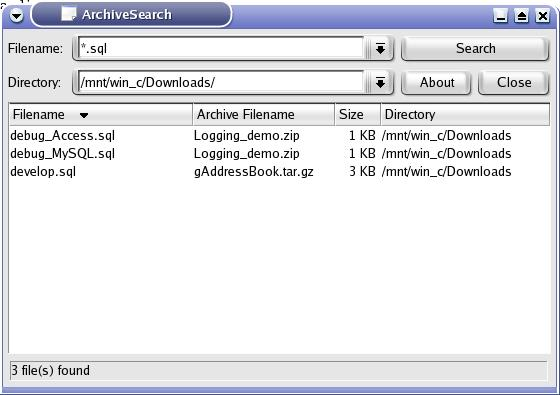

# archivesearch

**RETIRED!!!** It was developed 16 years back during my college days. The repository is purely for archival purpose. The source is can't be built.

This is small utility developed in KDE which can search inside archives
such as zip, tar and tar.gz(or tgz). The main feature of Archive Search is, it is a multithreaded application. So it won't freeze the main window.At any time you can stop the searching or even u can skip the current searching directory.

The previous version of Archive Search is developed in Qt. Now i ported it to KDE. The previous version only capable of searching inside zip archives. Now i added support for tar and tar.gz. I also planned to give support rar, arj and other archive formats.

